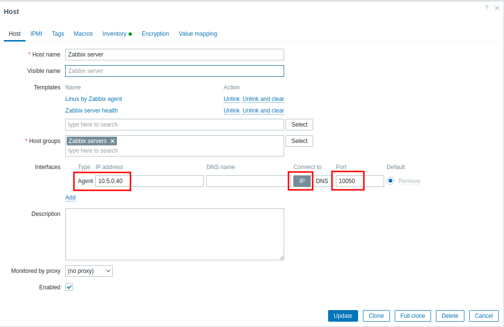
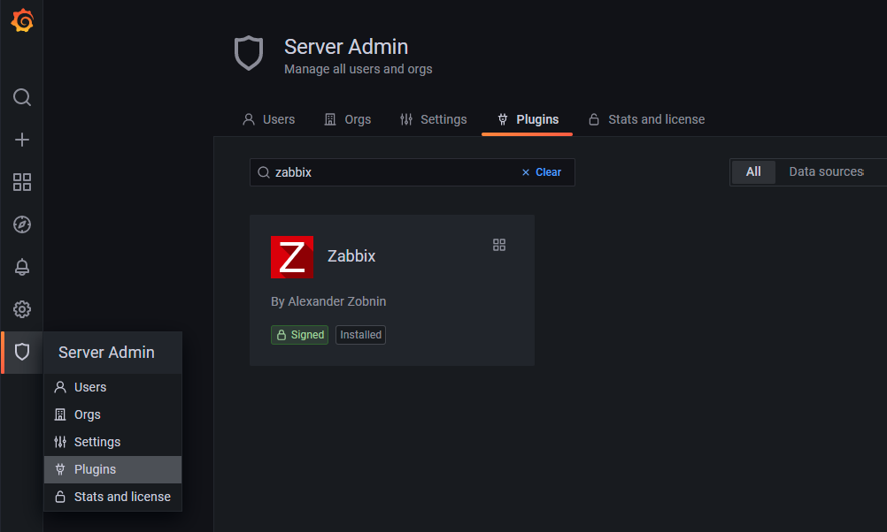
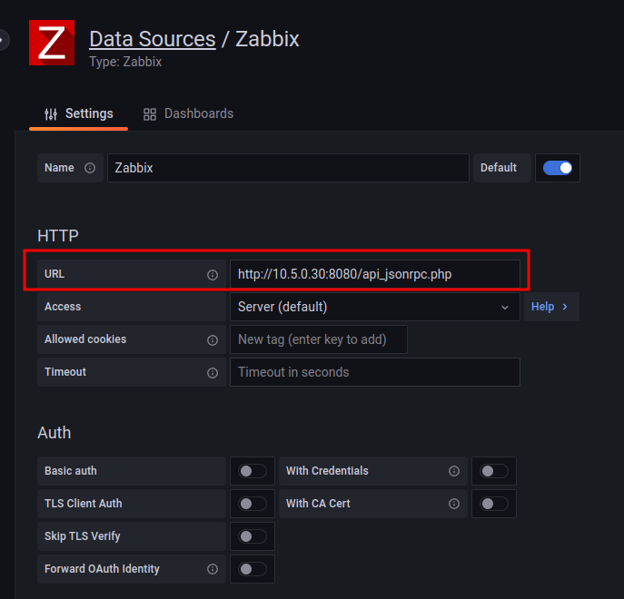
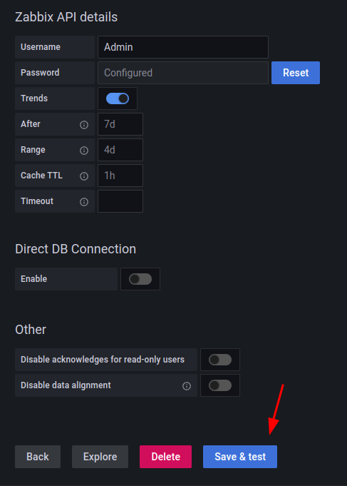

# Docker Zabbix Grafana PostgreSQL NGINX 

## Componentes do docker-compose:

- Postgresql 14.5
- Zabbix Server 6.2
- Zabbix Frontend NGINX 6.2
- Zabbix Agent 6.2
- Grafana 9.1.4

### Instalação

1) Clone:
```
git clone https://github.com/akmalovaa/zabbix-docker.git
cd zabbix-docker
```

2) Alterar owner da pasta:

```
chown -R 472:472 grafana
```

3) Executar o docker-compose:
```
docker-compose up -d
```

### Logs
```
docker-compose logs --tail=1 -f
```


# Setup

Host IP address (LXC): 10.27.0.10

-   Zabbix Web: http://localhost:8080
-   Grafana: http://localhost:3000

---

## Zabbix

Acesso ao Zabbix pelo endereço `localhost:8080`

-   Login: Admin
-   Password: zabbix

Configurando o Zabbix Agent

Configurations -> Hosts -> `10.5.0.40` - IP fixo do container do Agent



---

## Grafana

Acesso ao Grafana `localhost:3000`

-   Login: admin
-   Password: admin

Em seguida será apresentado uma tela para trocar a senha

### Enable Zabbix plugin



### Adding a Data Source ('zabbix-frontend' IP)

-   HTTP URL: http://10.5.0.30:8080/api_jsonrpc.php
-   Zabbix API details User: Admin
-   Zabbix API details Password: zabbix



Checking and saving (Save & test)



---

## Conclusão

Após adicionar novos hosts (nodes) ao Zabbix, é necessario ir em *Data Source -> Zabbix* e clicar em *Save & Test novamente*
